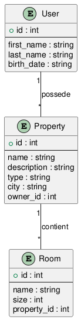

# immobilier-api

source venv/bin/activate
python init_db.py
python run.py


# Immobilier API

## Description

Ce projet est une application web de gestion immobilière basée sur une architecture de microservices simplifiée.
Elle permet de gérer des utilisateurs, leurs biens immobiliers, ainsi que les pièces associées à ces biens.

L’application expose une API REST et propose également une interface web minimaliste pour tester les fonctionnalités.

---

## Fonctionnalités

### Utilisateurs

* Créer un utilisateur
* Consulter un utilisateur
* Modifier ses informations (nom, prénom, date de naissance)
* Accéder à son profil via un formulaire

### Biens immobiliers

* Créer un bien
* Consulter les détails d'un bien
* Modifier/Supprimer son bien
* Consulter uniquement les biens d'une ville particulière

### Pièces

* Ajouter une pièce à un de ses biens
* Supprimer une pièce à un de ses biens

### Sécurité (simplifiée)

* Simulation d’un utilisateur connecté via header HTTP (`X-User-Id`)
* Un utilisateur ne peut modifier que :

  * ses propres informations
  * ses propres biens
  * les pièces de ses biens

---

## Stack technique

* **Langage** : Python
* **Framework** : Flask
* **Base de données** : SQLite
* **Front** : HTML (léger; sans CSS)

---

## Structure du projet

```
immobilier-api/
│
├── app/
│   ├── __init__.py        # création de l'app Flask
│   ├── modeles/
│   │   ├── __init__.py
│   │   ├── utilisateur.py
│   │   ├── bien.py
│   │   └── piece.py
│   ├── routes/
│   │   ├── __init__.py
│   │   ├── utilisateur_routes.py
│   │   ├── bien_routes.py
│   │   └── pieces_routes.py
│   └── templates/
│       ├── index.html
│       ├── login.html
│       ├── utilisateur.html
│       ├── utilisateur_detail.html
│      ...
│       ├── bien_edit.html
│       └── piece.html
│
├── __init__.py
├── config.py
├── run.py                # point d’entrée de l’application
├── init_db.py            # script d’initialisation de la base
├── instance/
│   └── database.db       # base SQLite
└── README.md
```

## Diagramme des modèles

Le diagramme ci-dessous représente les trois classes principales de l’application et leurs relations :

- **Utilisateur** : contient les informations personnelles (nom, prénom, date de naissance) et est lié aux biens qu’il possède.  
- **Bien** : représente un bien immobilier avec ses caractéristiques (nom, description, type, ville) et un propriétaire (`Utilisateur`).  
- **Piece** : correspond aux pièces d’un bien (nom, taille) et est rattachée à un **Bien**.  




---

## Installation

### 1. Cloner le projet

```bash
git clone https://github.com/guigz7/immobilier-api.git
cd immobilier-api
```

### 2. Créer un environnement virtuel

```bash
python -m venv venv
source venv/bin/activate
```

### 3. Installer les dépendances

```bash
pip install flask flask_sqlalchemy  # Linux / Mac
```
A installer hors de l'environnement virtuel si sur Arch

---

## Initialiser la base de données

```bash
python init_db.py
```

Ce script :

* réinitialise les tables
* ajoute des utilisateurs de test
* ajoute des biens
* ajoute des pièces

---

## Lancer l’application

```bash
python run.py
```

Accès :

```
http://localhost:5000
```

---

## Utilisation

### Accueil

* `/` → navigation principale

### Utilisateurs

* `/users/form` → créer un utilisateur
* `/users/<id>` → voir un profil
* `/users/<id>/edit` → modifier un profil

### Biens

* `/biens/vue` → liste des biens
* `/biens/<id>` → détail d’un bien
* `/biens/<id>/edit` → modifier un bien
* `/biens/<id>/delete` → supprimer un bien

### Pièces

* ajout via la page détail d’un bien
* suppression via bouton sur chaque pièce

---

## Sécurité

Une sécurité simplifiée est mise en place :

* utilisation du header :

```
X-User-Id: <id>
```

* vérifications côté serveur :

```python
if str(bien.proprietaire_id) != current_user_id:
    return "Non autorisé", 403
```

---

## Choix techniques

* **SQLAlchemy** pour gérer les relations entre entités
* **SQLite** pour un environnement léger, portable et compatible avec ArchLinux
* Architecture modulaire avec **Blueprints**

---

## Améliorations possibles

* Authentification réelle (JWT / session)
* Ajout d’un frontend (React / Vue)
* Ajout de tests automatisés
